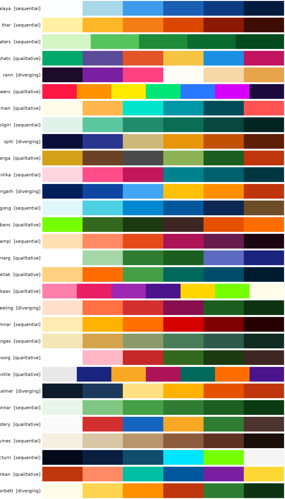
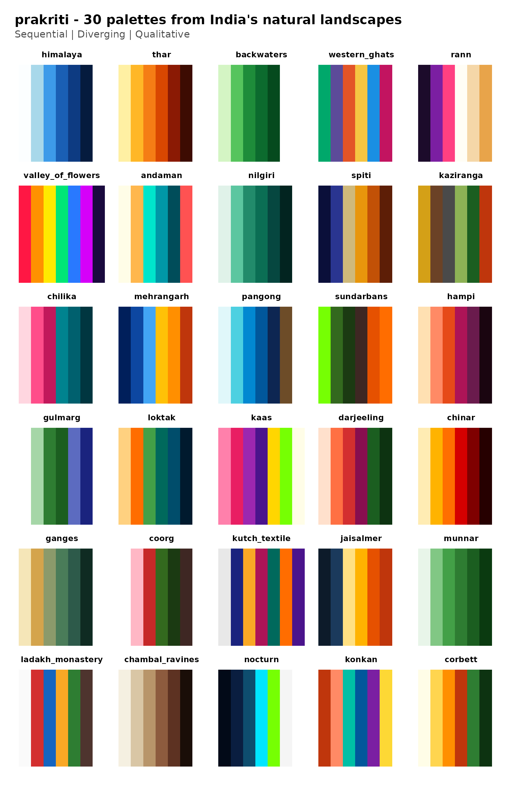
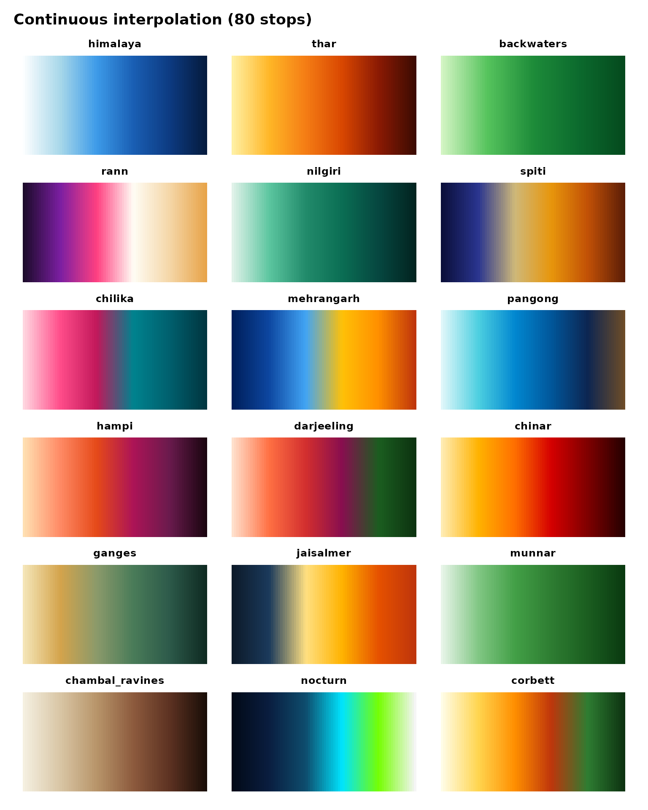

# Palette gallery

All 30 palettes at a glance. Use this page to pick the right one for
your plot.

## Swatch grid

``` r

library(prakriti)
display_prakriti()
```



## Faceted poster

A ggplot2 version, handy if you want to save it as a PNG or drop it into
a slide deck.

``` r

library(ggplot2)

gallery_df <- do.call(rbind, lapply(prakriti_names(), function(nm) {
  pal <- prakriti_palettes[[nm]]
  data.frame(
    palette = nm,
    type    = pal$type,
    pos     = seq_along(pal$colors),
    color   = pal$colors,
    stringsAsFactors = FALSE
  )
}))
gallery_df$palette <- factor(gallery_df$palette, levels = prakriti_names())

ggplot(gallery_df, aes(x = pos, y = 1, fill = color)) +
  geom_tile(height = 0.9) +
  scale_fill_identity() +
  facet_wrap(~ palette, ncol = 5, strip.position = "top") +
  labs(
    title    = "prakriti - 30 palettes from India's natural landscapes",
    subtitle = "Sequential | Diverging | Qualitative"
  ) +
  theme_void(base_size = 11) +
  theme(
    plot.title    = element_text(face = "bold", hjust = 0, size = rel(1.3),
                                 margin = margin(b = 4)),
    plot.subtitle = element_text(hjust = 0, color = "grey30",
                                 margin = margin(b = 12)),
    strip.text    = element_text(face = "bold", size = rel(0.8),
                                 margin = margin(b = 2)),
    plot.margin   = margin(16, 16, 16, 16)
  )
```



## Continuous ramps

Sequential and diverging palettes interpolated to 80 stops, so you can
see how they look as smooth gradients.

``` r

seq_div <- prakriti_info()
seq_div <- seq_div[seq_div$type != "qualitative", ]

ramp_df <- do.call(rbind, lapply(seq_div$name, function(nm) {
  cols <- prakriti_palette(nm, n = 80, type = "continuous")
  data.frame(
    palette = nm,
    pos     = seq_along(cols),
    color   = cols,
    stringsAsFactors = FALSE
  )
}))
ramp_df$palette <- factor(ramp_df$palette, levels = seq_div$name)

ggplot(ramp_df, aes(pos, 1, fill = color)) +
  geom_tile() +
  scale_fill_identity() +
  facet_wrap(~ palette, ncol = 3, strip.position = "top") +
  labs(title = "Continuous interpolation (80 stops)") +
  theme_void(base_size = 11) +
  theme(
    plot.title = element_text(face = "bold", margin = margin(b = 10)),
    strip.text = element_text(face = "bold", size = rel(0.85),
                               margin = margin(b = 2)),
    plot.margin = margin(12, 12, 12, 12)
  )
```



## Palette metadata

``` r

knitr::kable(prakriti_info(), row.names = FALSE)
```

| name | type | n | inspiration |
|:---|:---|---:|:---|
| himalaya | sequential | 6 | Blinding snow, glacial turquoise, bottomless Himalayan sky |
| thar | sequential | 6 | Blazing Rajasthan dunes, saffron sunset, scorched earth |
| backwaters | sequential | 5 | Luminous Kerala palms reflected in emerald water |
| western_ghats | qualitative | 6 | Monsoon: orchids, laterite, kingfishers, butterflies |
| rann | diverging | 6 | Infinite white salt flats, flamingo shock-pink, violet dusk |
| valley_of_flowers | qualitative | 7 | Carpets of alpine wildflowers - every color screaming at once |
| andaman | qualitative | 6 | Electric turquoise shallows, fire coral, bleached sand |
| nilgiri | sequential | 6 | Blue-green mountains disappearing into monsoon mist |
| spiti | diverging | 6 | Stark indigo night sky crashing into sun-scorched ochre cliffs |
| kaziranga | qualitative | 6 | Golden elephant grass, rhino armor, river mud, tiger flash |
| chilika | sequential | 6 | Flamingo clouds over pewter lagoon at first light |
| mehrangarh | diverging | 6 | Jodhpur’s electric blue houses blazing under golden hour |
| pangong | sequential | 6 | Pangong Tso shifting from turquoise to ultramarine to ink |
| sundarbans | qualitative | 6 | Neon mangrove canopy, dark tidal roots, tiger-flame ambush |
| hampi | sequential | 6 | Rose-gold boulders catching sunset fire, fading to magenta night |
| gulmarg | qualitative | 6 | Blinding snow, vivid meadow, deodar silhouettes against indigo dusk |
| loktak | qualitative | 6 | Amber dawn, floating green phumdis on deep teal water |
| kaas | qualitative | 7 | Explosive wildflower carpets - hot pink, violet, acid green, gold |
| darjeeling | diverging | 6 | Kanchenjunga on fire at sunrise, plunging into deep tea-estate green |
| chinar | sequential | 6 | Kashmir’s chinar ablaze - gold to vermilion to smoldering embers |
| ganges | sequential | 6 | Sacred river at dawn - silt gold, monsoon green, deep current |
| coorg | qualitative | 6 | Coffee blossoms, red laterite, rain-soaked plantation green |
| kutch_textile | qualitative | 7 | Rann at festival - mirrorwork silver, indigo, turmeric, madder |
| jaisalmer | diverging | 6 | Sandstone fort glowing at noon, cooling into blue twilight |
| munnar | sequential | 6 | Rolling tea carpets from bright flush to deep shade |
| ladakh_monastery | qualitative | 6 | Whitewashed walls, prayer-flag primaries against barren rock |
| chambal_ravines | sequential | 6 | Eroded badlands - bone white, khaki, terracotta, deep shadow |
| nocturn | sequential | 6 | Bioluminescent shores of Havelock - ink sky to starlight |
| konkan | qualitative | 6 | Laterite cliffs, coconut spray, Arabian Sea teal, monsoon violet |
| corbett | diverging | 6 | Sal forest dawn - gold mist, tiger-stripe amber, deep canopy |
