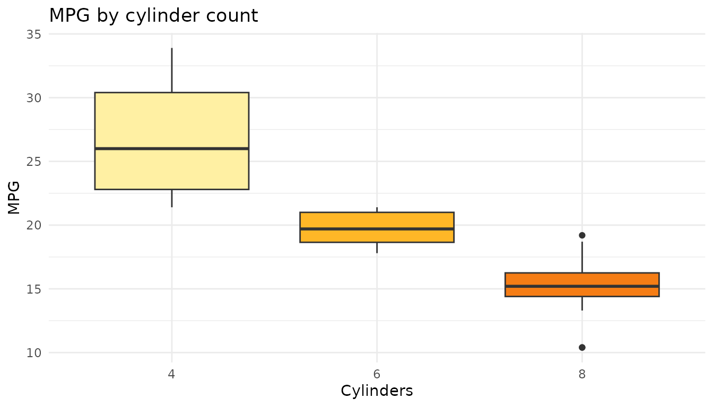

# Getting started with prakriti

## What is prakriti?

**prakriti** (Sanskrit for *nature*) gives you 30 color palettes pulled
from Indian landscapes. Each one is built for a specific job -
sequential for ordered data, diverging for data with a midpoint,
qualitative for categories - and they all plug straight into `ggplot2`.

``` r

library(prakriti)
library(ggplot2)
```

## Finding your way around

[`prakriti_names()`](https://orijitghosh.github.io/prakriti/reference/prakriti_names.md)
lists every palette.
[`prakriti_info()`](https://orijitghosh.github.io/prakriti/reference/prakriti_info.md)
gives you the full picture - name, type, number of colors, and what
landscape inspired it.

``` r

prakriti_names()
#>  [1] "himalaya"          "thar"              "backwaters"       
#>  [4] "western_ghats"     "rann"              "valley_of_flowers"
#>  [7] "andaman"           "nilgiri"           "spiti"            
#> [10] "kaziranga"         "chilika"           "mehrangarh"       
#> [13] "pangong"           "sundarbans"        "hampi"            
#> [16] "gulmarg"           "loktak"            "kaas"             
#> [19] "darjeeling"        "chinar"            "ganges"           
#> [22] "coorg"             "kutch_textile"     "jaisalmer"        
#> [25] "munnar"            "ladakh_monastery"  "chambal_ravines"  
#> [28] "nocturn"           "konkan"            "corbett"
prakriti_info()
#>                 name        type n
#> 1           himalaya  sequential 6
#> 2               thar  sequential 6
#> 3         backwaters  sequential 5
#> 4      western_ghats qualitative 6
#> 5               rann   diverging 6
#> 6  valley_of_flowers qualitative 7
#> 7            andaman qualitative 6
#> 8            nilgiri  sequential 6
#> 9              spiti   diverging 6
#> 10         kaziranga qualitative 6
#> 11           chilika  sequential 6
#> 12        mehrangarh   diverging 6
#> 13           pangong  sequential 6
#> 14        sundarbans qualitative 6
#> 15             hampi  sequential 6
#> 16           gulmarg qualitative 6
#> 17            loktak qualitative 6
#> 18              kaas qualitative 7
#> 19        darjeeling   diverging 6
#> 20            chinar  sequential 6
#> 21            ganges  sequential 6
#> 22             coorg qualitative 6
#> 23     kutch_textile qualitative 7
#> 24         jaisalmer   diverging 6
#> 25            munnar  sequential 6
#> 26  ladakh_monastery qualitative 6
#> 27   chambal_ravines  sequential 6
#> 28           nocturn  sequential 6
#> 29            konkan qualitative 6
#> 30           corbett   diverging 6
#>                                                             inspiration
#> 1            Blinding snow, glacial turquoise, bottomless Himalayan sky
#> 2               Blazing Rajasthan dunes, saffron sunset, scorched earth
#> 3                      Luminous Kerala palms reflected in emerald water
#> 4                  Monsoon: orchids, laterite, kingfishers, butterflies
#> 5           Infinite white salt flats, flamingo shock-pink, violet dusk
#> 6         Carpets of alpine wildflowers - every color screaming at once
#> 7                Electric turquoise shallows, fire coral, bleached sand
#> 8                   Blue-green mountains disappearing into monsoon mist
#> 9        Stark indigo night sky crashing into sun-scorched ochre cliffs
#> 10           Golden elephant grass, rhino armor, river mud, tiger flash
#> 11                    Flamingo clouds over pewter lagoon at first light
#> 12             Jodhpur's electric blue houses blazing under golden hour
#> 13            Pangong Tso shifting from turquoise to ultramarine to ink
#> 14           Neon mangrove canopy, dark tidal roots, tiger-flame ambush
#> 15     Rose-gold boulders catching sunset fire, fading to magenta night
#> 16  Blinding snow, vivid meadow, deodar silhouettes against indigo dusk
#> 17                Amber dawn, floating green phumdis on deep teal water
#> 18    Explosive wildflower carpets - hot pink, violet, acid green, gold
#> 19 Kanchenjunga on fire at sunrise, plunging into deep tea-estate green
#> 20     Kashmir's chinar ablaze - gold to vermilion to smoldering embers
#> 21        Sacred river at dawn - silt gold, monsoon green, deep current
#> 22          Coffee blossoms, red laterite, rain-soaked plantation green
#> 23       Rann at festival - mirrorwork silver, indigo, turmeric, madder
#> 24           Sandstone fort glowing at noon, cooling into blue twilight
#> 25                  Rolling tea carpets from bright flush to deep shade
#> 26         Whitewashed walls, prayer-flag primaries against barren rock
#> 27         Eroded badlands - bone white, khaki, terracotta, deep shadow
#> 28             Bioluminescent shores of Havelock - ink sky to starlight
#> 29     Laterite cliffs, coconut spray, Arabian Sea teal, monsoon violet
#> 30         Sal forest dawn - gold mist, tiger-stripe amber, deep canopy
```

Filter by type if you know what kind of data you’re working with:

``` r

info <- prakriti_info()
info[info$type == "diverging", ]
#>          name      type n
#> 5        rann diverging 6
#> 9       spiti diverging 6
#> 12 mehrangarh diverging 6
#> 19 darjeeling diverging 6
#> 24  jaisalmer diverging 6
#> 30    corbett diverging 6
#>                                                             inspiration
#> 5           Infinite white salt flats, flamingo shock-pink, violet dusk
#> 9        Stark indigo night sky crashing into sun-scorched ochre cliffs
#> 12             Jodhpur's electric blue houses blazing under golden hour
#> 19 Kanchenjunga on fire at sunrise, plunging into deep tea-estate green
#> 24           Sandstone fort glowing at noon, cooling into blue twilight
#> 30         Sal forest dawn - gold mist, tiger-stripe amber, deep canopy
```

## Pulling colors

[`prakriti_palette()`](https://orijitghosh.github.io/prakriti/reference/prakriti_palette.md)
returns a character vector of hex codes. By default you get the full
palette. Pass `n` to grab a subset.

``` r

prakriti_palette("thar")
#> [1] "#FFF0A3" "#FFB727" "#F57D15" "#D94701" "#8B1A04" "#3D0C02"
#> attr(,"name")
#> [1] "thar"
#> attr(,"type")
#> [1] "sequential"
prakriti_palette("himalaya", n = 3)
#> [1] "#FCFEFF" "#A8D8EA" "#3D9BE9"
#> attr(,"name")
#> [1] "himalaya"
#> attr(,"type")
#> [1] "sequential"
```

Reverse any palette with `direction = -1`:

``` r

prakriti_palette("chinar", direction = -1)
#> [1] "#260000" "#7F0000" "#D50000" "#FF6F00" "#FFB300" "#FFECB3"
#> attr(,"name")
#> [1] "chinar"
#> attr(,"type")
#> [1] "sequential"
```

Need more colors than the palette has? Interpolate smoothly:

``` r

prakriti_palette("nilgiri", n = 15, type = "continuous")
#>  [1] "#E0F2E9" "#B0E2CE" "#81D2B4" "#57C19C" "#43AC89" "#2E9776" "#1E8667"
#>  [8] "#167C5F" "#0E7257" "#09654F" "#085748" "#064941" "#043D36" "#03302B"
#> [15] "#022420"
#> attr(,"name")
#> [1] "nilgiri"
#> attr(,"type")
#> [1] "sequential"
```

## Viewing palettes

Single palette:

``` r

display_prakriti("valley_of_flowers")
```


The whole collection (make your plot pane tall):

``` r

display_prakriti()
```


## Using with ggplot2

Qualitative palettes default to discrete scales. Sequential and
diverging default to continuous. You can override with `discrete = TRUE`
or `FALSE`.

``` r

ggplot(iris, aes(Sepal.Length, Petal.Length,
                 color = Species, shape = Species)) +
  geom_point(size = 3, alpha = 0.85) +
  scale_color_prakriti("valley_of_flowers") +
  labs(title = "Iris measurements",
       x = "Sepal length (cm)", y = "Petal length (cm)") +
  theme_minimal()
```


``` r

ggplot(faithfuld, aes(waiting, eruptions, fill = density)) +
  geom_raster(interpolate = TRUE) +
  scale_fill_prakriti("himalaya") +
  coord_cartesian(expand = FALSE) +
  labs(title = "Old Faithful eruption density") +
  theme_minimal()
```


``` r

ggplot(mtcars, aes(factor(cyl), mpg, fill = factor(cyl))) +
  geom_boxplot() +
  scale_fill_prakriti("thar", discrete = TRUE) +
  labs(title = "MPG by cylinder count", x = "Cylinders", y = "MPG") +
  theme_minimal() +
  theme(legend.position = "none")
```



## What’s next

- [Palette
  gallery](https://orijitghosh.github.io/prakriti/articles/gallery.md) -
  all 30 palettes as swatches, continuous ramps, and a full metadata
  table
- [Sequential & diverging
  recipes](https://orijitghosh.github.io/prakriti/articles/sequential-diverging.md) -
  heatmaps, contours, correlation tiles, calendar charts, temperature
  anomaly maps
- [Qualitative
  recipes](https://orijitghosh.github.io/prakriti/articles/qualitative.md) -
  scatter plots, stacked areas, grouped bars, donut charts, ridgelines,
  dark-mode density plots
