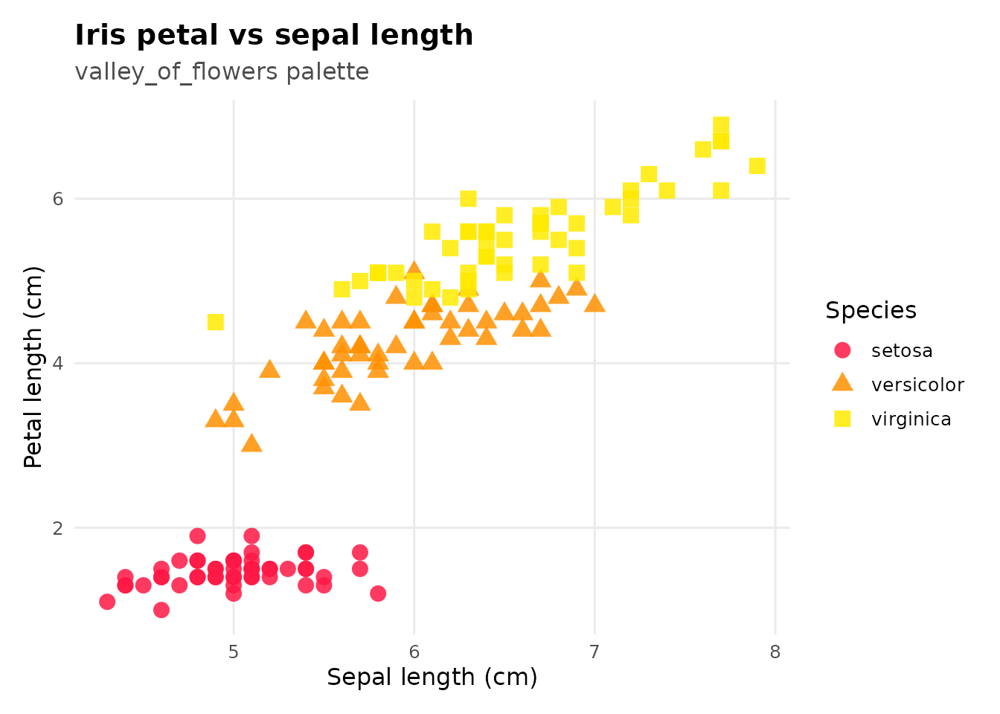
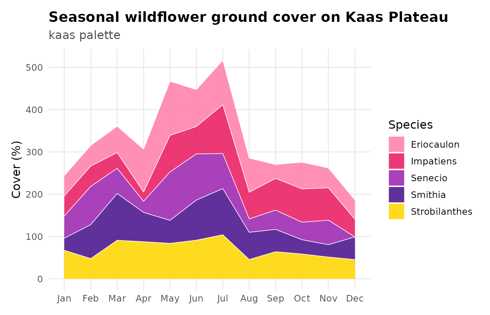
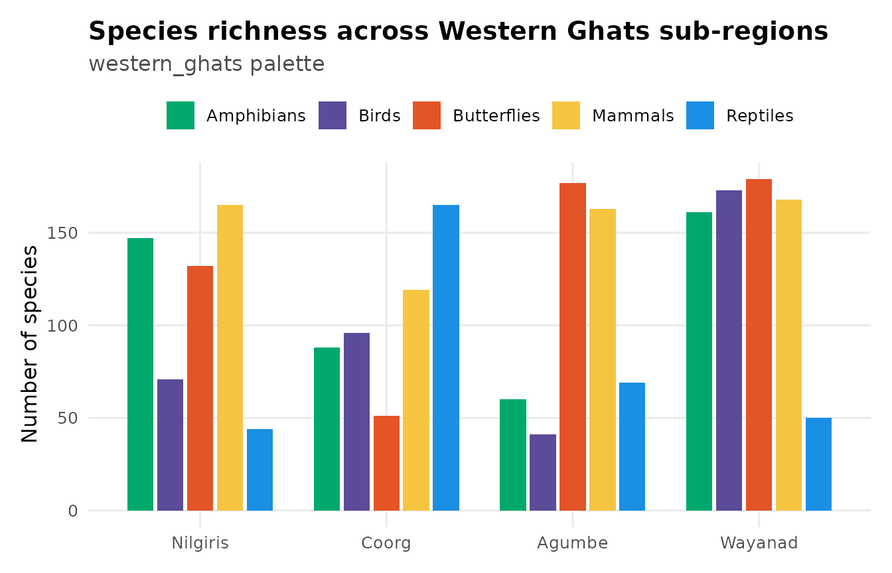
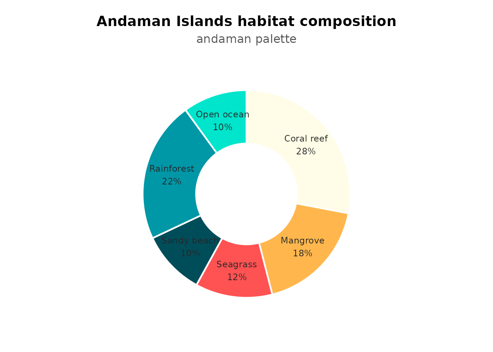
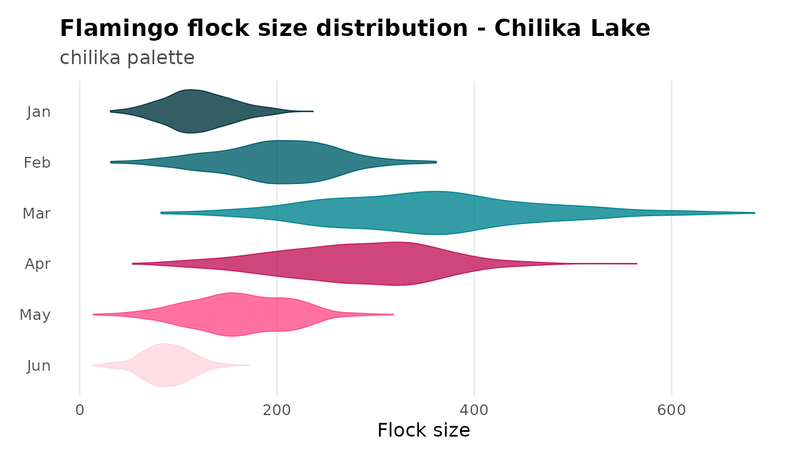
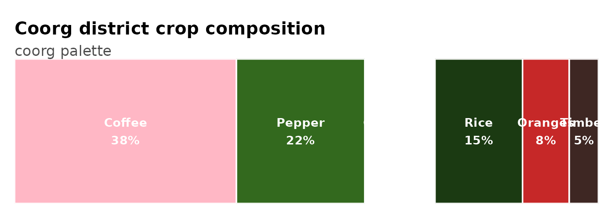
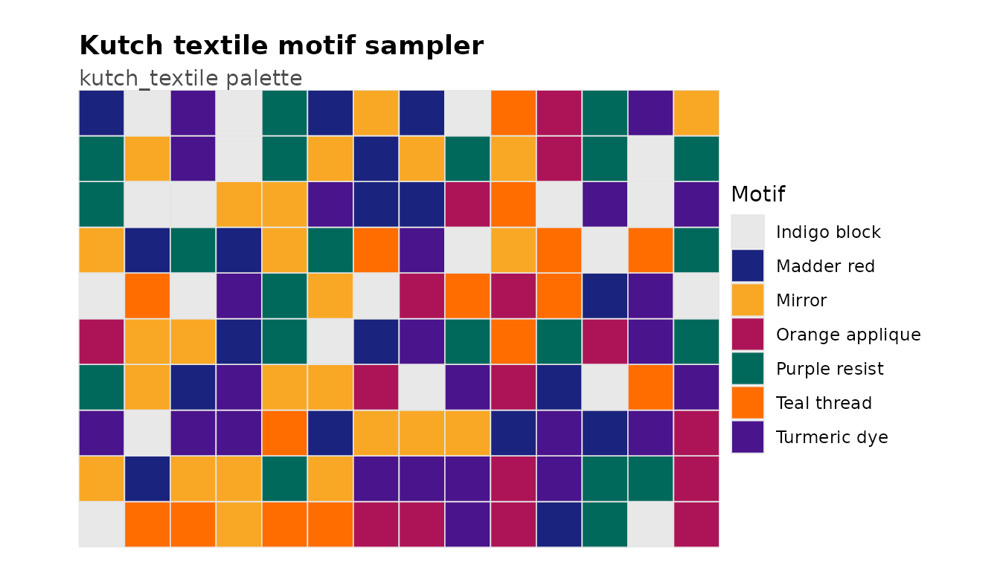
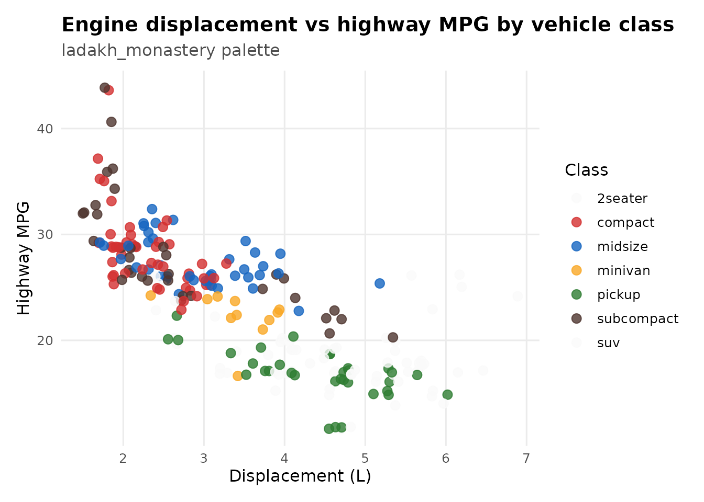
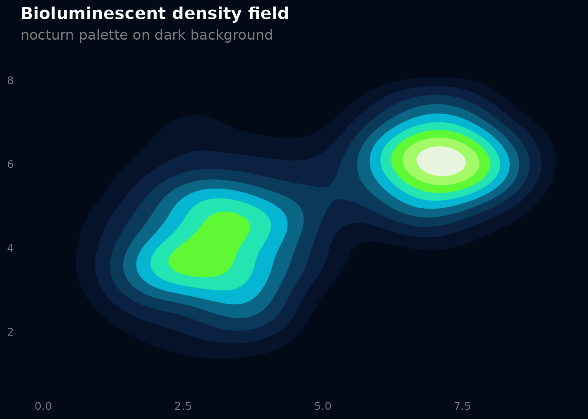
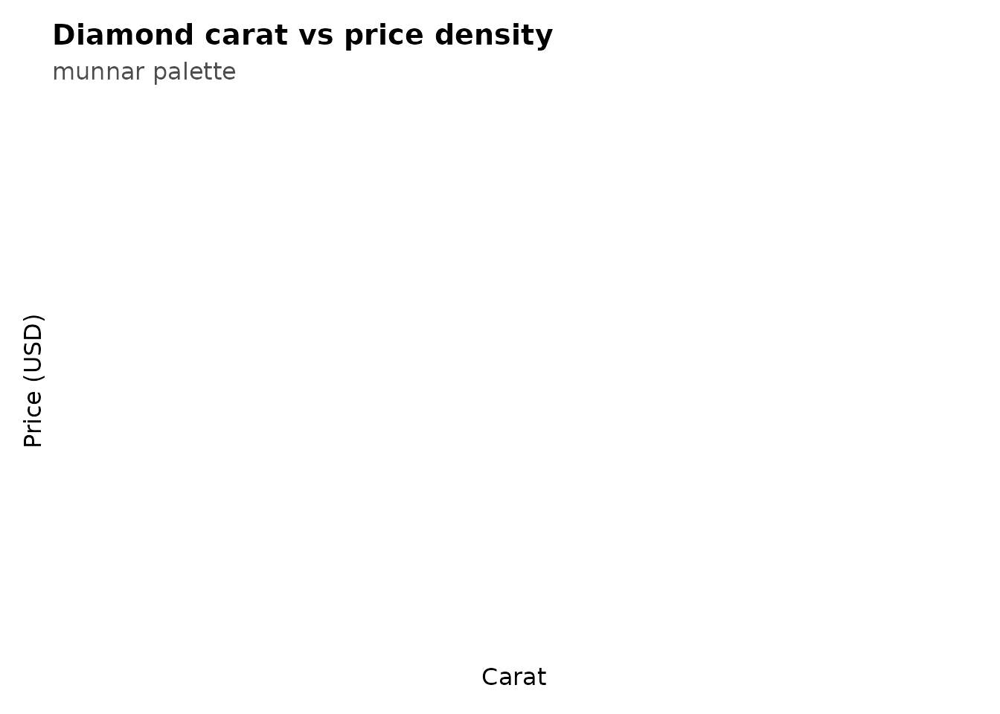

# Recipes: qualitative palettes

Qualitative palettes are for categorical data where no category is
“higher” or “lower” than another. The colors need to be distinct, not
ordered. This article shows common plot types where qualitative palettes
shine.

## Scatter plot - valley_of_flowers

The most basic use. Three species, three vivid colors that don’t suggest
any ordering.

``` r

ggplot(iris, aes(Sepal.Length, Petal.Length,
                 color = Species, shape = Species)) +
  geom_point(size = 3.5, alpha = 0.85) +
  scale_color_prakriti("valley_of_flowers") +
  labs(
    title = "Iris petal vs sepal length",
    subtitle = "valley_of_flowers palette",
    x = "Sepal length (cm)", y = "Petal length (cm)"
  ) +
  theme_prak()
```



## Stacked area chart - kaas

Five wildflower species tracked across months. `kaas` has 7 colors, so 5
categories sit comfortably without recycling.

``` r

set.seed(42)
months <- rep(month.abb, each = 5)
species <- rep(c("Strobilanthes", "Smithia", "Impatiens",
                 "Senecio", "Eriocaulon"), 12)
area_df <- data.frame(
  month   = factor(months, levels = month.abb),
  species = species,
  cover   = pmax(0, rnorm(60, 40, 20) +
                    rep(c(0, 10, 25, 35, 50, 60, 55, 40, 20, 10, 5, 0),
                        each = 5))
)

ggplot(area_df, aes(month, cover, fill = species, group = species)) +
  geom_area(alpha = 0.88, color = "white", linewidth = 0.3) +
  scale_fill_prakriti("kaas") +
  labs(
    title = "Seasonal wildflower ground cover on Kaas Plateau",
    subtitle = "kaas palette",
    x = NULL, y = "Cover (%)", fill = "Species"
  ) +
  theme_prak()
```



## Grouped bar chart - western_ghats

Comparing species richness across regions. `western_ghats` gives each
taxonomic group a distinct color that reads well side by side.

``` r

set.seed(7)
bio_df <- data.frame(
  region   = rep(c("Nilgiris", "Coorg", "Agumbe", "Wayanad"), each = 5),
  taxon    = rep(c("Birds", "Butterflies", "Reptiles",
                   "Amphibians", "Mammals"), 4),
  richness = sample(30:180, 20, replace = TRUE)
)
bio_df$region <- factor(bio_df$region,
                        levels = c("Nilgiris", "Coorg", "Agumbe", "Wayanad"))

ggplot(bio_df, aes(region, richness, fill = taxon)) +
  geom_col(position = position_dodge(width = 0.8), width = 0.7) +
  scale_fill_prakriti("western_ghats") +
  labs(
    title = "Species richness across Western Ghats sub-regions",
    subtitle = "western_ghats palette",
    x = NULL, y = "Number of species", fill = NULL
  ) +
  theme_prak() +
  theme(legend.position = "top")
```



## Donut chart - andaman

Proportional habitat composition. `andaman` pairs turquoise ocean tones
with a coral-red accent that makes the donut segments pop.

``` r

pie_df <- data.frame(
  habitat = c("Coral reef", "Mangrove", "Seagrass",
              "Sandy beach", "Rainforest", "Open ocean"),
  pct     = c(28, 18, 12, 10, 22, 10)
)
pie_df$ymax <- cumsum(pie_df$pct)
pie_df$ymin <- c(0, head(pie_df$ymax, -1))
pie_df$mid  <- (pie_df$ymin + pie_df$ymax) / 2
pie_df$label <- paste0(pie_df$habitat, "\n", pie_df$pct, "%")

ggplot(pie_df, aes(ymax = ymax, ymin = ymin, xmax = 4, xmin = 2.2,
                   fill = habitat)) +
  geom_rect(color = "white", linewidth = 0.8) +
  geom_text(aes(x = 3.1, y = mid, label = label),
            size = 3.2, color = "grey15") +
  scale_fill_prakriti("andaman") +
  coord_polar(theta = "y") +
  xlim(c(0.5, 4.5)) +
  labs(
    title = "Andaman Islands habitat composition",
    subtitle = "andaman palette"
  ) +
  theme_void(base_size = 12) +
  theme(
    plot.title    = element_text(face = "bold", hjust = 0.5),
    plot.subtitle = element_text(hjust = 0.5, color = "grey35"),
    legend.position = "none",
    plot.margin = margin(10, 10, 10, 10)
  )
```



## Violin ridgeline - chilika

Simulated flamingo flock sizes across months. Using
[`scale_fill_manual()`](https://ggplot2.tidyverse.org/reference/scale_manual.html)
with colors pulled from
[`prakriti_palette()`](https://orijitghosh.github.io/prakriti/reference/prakriti_palette.md)
gives you full control when you need the fill and color aesthetics to
match.

``` r

set.seed(123)
ridge_df <- do.call(rbind, lapply(1:6, function(m) {
  n <- 400
  base_mu <- c(120, 200, 350, 280, 160, 90)[m]
  data.frame(
    month = factor(month.abb[m], levels = rev(month.abb[1:6])),
    flock = pmax(0, rnorm(n, base_mu, base_mu * 0.3))
  )
}))

cols_chilika <- prakriti_palette("chilika")

ggplot(ridge_df, aes(flock, month, fill = month, color = month)) +
  geom_violin(scale = "width", width = 0.85, alpha = 0.8,
              trim = TRUE, linewidth = 0.3) +
  scale_fill_manual(values = cols_chilika) +
  scale_color_manual(values = cols_chilika) +
  labs(
    title = "Flamingo flock size distribution - Chilika Lake",
    subtitle = "chilika palette",
    x = "Flock size", y = NULL
  ) +
  theme_prak() +
  theme(legend.position = "none",
        panel.grid.major.y = element_blank())
```



## Proportion bar - coorg

Horizontal stacked proportions for crop composition. Works well with
[`geom_rect()`](https://ggplot2.tidyverse.org/reference/geom_tile.html)
when you want labeled segments.

``` r

crops <- data.frame(
  crop = c("Coffee", "Pepper", "Cardamom", "Rice", "Oranges", "Timber"),
  area = c(38, 22, 12, 15, 8, 5)
)
crops$xmax <- cumsum(crops$area)
crops$xmin <- c(0, head(crops$xmax, -1))
crops$mid  <- (crops$xmin + crops$xmax) / 2

ggplot(crops, aes(xmin = xmin, xmax = xmax, ymin = 0, ymax = 1,
                  fill = crop)) +
  geom_rect(color = "white", linewidth = 0.6) +
  geom_text(aes(x = mid, y = 0.5,
                label = paste0(crop, "\n", area, "%")),
            color = "white", fontface = "bold", size = 3.5) +
  scale_fill_prakriti("coorg") +
  coord_cartesian(expand = FALSE) +
  labs(
    title = "Coorg district crop composition",
    subtitle = "coorg palette"
  ) +
  theme_void(base_size = 12) +
  theme(
    plot.title    = element_text(face = "bold"),
    plot.subtitle = element_text(color = "grey30"),
    legend.position = "none",
    plot.margin = margin(12, 12, 12, 12)
  )
```



## Tile grid - kutch_textile

A 7-color showcase. `kutch_textile` has enough distinct colors for
complex categorical data.

``` r

set.seed(77)
kutch_df <- data.frame(
  x     = rep(1:14, 10),
  y     = rep(1:10, each = 14),
  motif = sample(c("Mirror", "Indigo block", "Turmeric dye",
                    "Madder red", "Teal thread", "Orange applique",
                    "Purple resist"), 140, replace = TRUE)
)

ggplot(kutch_df, aes(x, y, fill = motif)) +
  geom_tile(color = "grey90", linewidth = 0.3) +
  scale_fill_prakriti("kutch_textile") +
  coord_equal(expand = FALSE) +
  labs(
    title = "Kutch textile motif sampler",
    subtitle = "kutch_textile palette",
    fill = "Motif"
  ) +
  theme_void(base_size = 11) +
  theme(
    plot.title    = element_text(face = "bold"),
    plot.subtitle = element_text(color = "grey30"),
    plot.margin   = margin(12, 12, 12, 12)
  )
```



## Jittered scatter with many groups - ladakh_monastery

6 vehicle classes, each getting a prayer-flag primary.
`ladakh_monastery` keeps groups separable even when points overlap.

``` r

ggplot(mpg, aes(displ, hwy, color = class)) +
  geom_jitter(size = 2.8, alpha = 0.8, width = 0.15) +
  scale_color_prakriti("ladakh_monastery") +
  labs(
    title = "Engine displacement vs highway MPG by vehicle class",
    subtitle = "ladakh_monastery palette",
    x = "Displacement (L)", y = "Highway MPG", color = "Class"
  ) +
  theme_prak()
#> Warning: Requested 7 colors but 'ladakh_monastery' only has 6; recycling. Use
#> type = "continuous" for smooth interpolation.
```



## Dark-mode density - nocturn

`nocturn` starts from near-black, so it pairs naturally with a dark
background. Good for presentations or dashboards with dark themes.

``` r

set.seed(23)
bio_pts <- data.frame(
  x = c(rnorm(300, 3, 1.2), rnorm(200, 7, 0.8)),
  y = c(rnorm(300, 4, 1.5), rnorm(200, 6, 1.0))
)

ggplot(bio_pts, aes(x, y)) +
  stat_density_2d(aes(fill = after_stat(level)),
                  geom = "polygon", alpha = 0.85) +
  scale_fill_prakriti("nocturn", discrete = FALSE) +
  labs(
    title = "Bioluminescent density field",
    subtitle = "nocturn palette on dark background",
    x = NULL, y = NULL
  ) +
  theme_minimal(base_size = 12) +
  theme(
    plot.background  = element_rect(fill = "#020A18", color = NA),
    panel.background = element_rect(fill = "#020A18", color = NA),
    panel.grid       = element_blank(),
    text             = element_text(color = "grey80"),
    plot.title       = element_text(face = "bold", color = "white"),
    plot.subtitle    = element_text(color = "grey50"),
    axis.text        = element_text(color = "grey50"),
    legend.position  = "none"
  )
```



## Hex bin density - munnar

`munnar` is pure green - bright tea-flush to deep shade. Pairs well with
[`geom_hex()`](https://ggplot2.tidyverse.org/reference/geom_hex.html)
for bivariate density.

``` r

set.seed(42)
ggplot(diamonds[sample(nrow(diamonds), 5000), ],
       aes(carat, price)) +
  geom_hex(bins = 35) +
  scale_fill_prakriti("munnar", discrete = FALSE) +
  labs(
    title = "Diamond carat vs price density",
    subtitle = "munnar palette",
    x = "Carat", y = "Price (USD)", fill = "Count"
  ) +
  theme_prak()
#> Warning: Computation failed in `stat_binhex()`.
#> Caused by error in `compute_group()`:
#> ! The package "hexbin" is required for `stat_bin_hex()`.
```


